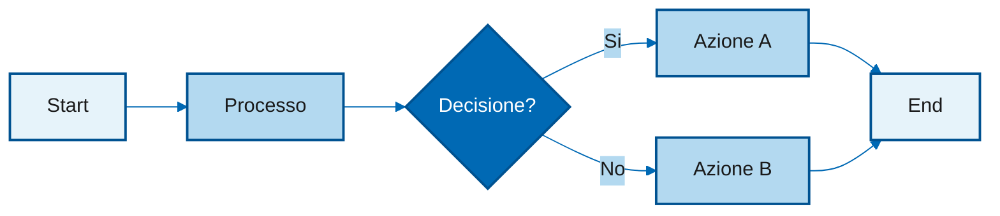

# Skill: Genera Slide Marp

Genera slide Marp a partire da una traccia del corso.

## Struttura Cartelle

Ogni script del corso ha la sua cartella in `piano-corso/`:

```
piano-corso/
├── themes/                          # Tema CSS condiviso
│   ├── corso.css
│   └── logo_zucchetti.svg
├── 1.1-cambio-di-paradigma/
│   ├── 1.1-cambio-di-paradigma.md       # Traccia originale
│   ├── 1.1-cambio-di-paradigma-marp.md  # Slide Marp
│   ├── 1.1-cambio-di-paradigma.pdf # PDF generato
│   └── diagrammi/
│       ├── loop-agentico.mmd
│       └── loop-agentico.svg
└── ...
```

## Input

Argomento: nome dello script (es. `1.1-cambio-di-paradigma`)

## Regole di Estrazione

Il file sorgente (es. `1.1-cambio-di-paradigma.md`) è uno **script per screencast** che contiene sia il contenuto delle slide che le istruzioni per il narratore. Il file `-marp.md` deve contenere **solo il markdown per le slide**.

### Struttura del File Sorgente

```
## SLIDE N: Titolo
**Contenuto slide**:        ← ESTRARRE (convertire in Marp)
```
...contenuto...
```
**Testo da leggere**:       ← IGNORARE (script narratore)
"..."

## DEMO N: Titolo
**Cosa mostrare**:          ← CONVERTIRE in slide demo
1. ...
**Punti da evidenziare**:   ← IGNORARE
**Testo da leggere durante la demo**: ← IGNORARE
```

### Cosa Estrarre

| Sezione sorgente | Azione | Output |
|------------------|--------|--------|
| Intestazione (Durata, Modulo, Scopo) | IGNORARE | - |
| `## SLIDE N:` + `**Contenuto slide**:` | ESTRARRE | Slide Marp |
| `**Testo da leggere**:` | IGNORARE | - |
| `## DEMO N:` + `**Cosa mostrare**:` | IGNORARE | - |
| `**Punti da evidenziare**:` | IGNORARE | - |
| `**Testo da leggere durante la demo**:` | IGNORARE | - |
| `## Note di Produzione` | IGNORARE | - |

### Processo di Estrazione

1. **Identifica** le sezioni `## SLIDE N:`
2. **Estrai** il contenuto dentro i blocchi ``` sotto `**Contenuto slide**:`
3. **Converti** i diagrammi ASCII in Mermaid (vedi Regole di Conversione)
5. **Ignora** tutto il resto (testo narratore, note produzione, metadati)

## Output

1. File `<nome>-marp.md` nella cartella dello script
2. File `<nome>.pdf` generato da Marp
3. Diagrammi Mermaid in `<nome>/diagrammi/`

---

## Frontmatter Standard

```yaml
---
marp: true
theme: corso
paginate: true
footer: 'Zucchetti Healthcare'
---
```

**Nota**: La prima slide (title) deve nascondere il footer con `<!-- _footer: '' -->`

---

## Design System

### Palette Colori

Basata sul colore ufficiale logo Zucchetti **#0069b4**:

| Colore | Valore | Uso |
|--------|--------|-----|
| Blu Zucchetti | `#0069b4` | Colore principale (titoli, UI, tabelle) |
| Blu scuro | `#005291` | Variante scura, enfasi |
| Blu chiaro | `#3399cc` | Elementi secondari |
| Blu sfondo | `#e6f3fa` | Sfondi leggeri |
| Grigio codice | `#f5f5f5` | Sfondo blocchi codice |
| Verde | `#28a745` | Solo checkmark takeaway |

### Classi CSS Disponibili

| Classe | Uso | Stile |
|--------|-----|-------|
| `title` | Prima slide | Sfondo blu gradient, 3 livelli testo |
| `section` | Separatore modulo | Sfondo blu |
| `diagram` | Diagrammi Mermaid | Titolo blu standard, NO bordi |
| `demo` | Istruzioni demo | Sfondo gradiente blu chiaro |
| `takeaway` | Punti chiave | Spunte verdi |

Applica la classe con `<!-- _class: nomeClasse -->` prima del contenuto.

---

## Regole di Conversione

### 1. SLIDE TITOLO (prima slide)

La slide titolo deve avere **3 livelli di testo** con gerarchia visiva:

```markdown
<!-- _class: title -->
<!-- _footer: '' -->

# Titolo Principale

Sottotitolo descrittivo

<small>Claude Code per Teams di Sviluppo</small>
```

**Gerarchia**: h1 (grande, bianco) > p (medio, 90% opacita) > small (piccolo, 70% opacita)

### 2. SLIDE CONTENUTO (da "## SLIDE N:")

Estrai il contenuto dalla sezione "**Contenuto slide**" della traccia.

```markdown
---

## Titolo della Slide

- Punto 1
- Punto 2
- Punto 3
```

**Note sulle liste:**
- Usare `-` per liste puntate (bullet tondi automatici)
- Usare `1.` per liste numerate
- Le spunte verdi appaiono SOLO nelle slide takeaway

### 3. SLIDE DIAGRAMMA (Mermaid)

**IMPORTANTE**: Converti SEMPRE i diagrammi ASCII in Mermaid con palette BLU.

1. Crea il file `.mmd` in `piano-corso/<nome>/diagrammi/`
2. Converti in SVG: `mmdc -p puppeteer-config.json -i piano-corso/<nome>/diagrammi/file.mmd -o piano-corso/<nome>/diagrammi/file.svg`
3. Includi nella slide:

```markdown
---
<!-- _class: diagram -->

## Titolo Diagramma


```

**Template Mermaid con palette BLU** (`diagrammi/nome.mmd`):



**Convenzioni colori diagrammi:**
| Tipo nodo | Fill | Stroke | Testo |
|-----------|------|--------|-------|
| Start/End | `#e6f3fa` | `#005291` | nero |
| Processo | `#b3d9f0` | `#005291` | nero |
| Decisione | `#0069b4` | `#005291` | bianco |

**Layout diagrammi - IMPORTANTE:**
- Preferisci `flowchart LR` (left-to-right) per sfruttare meglio lo spazio orizzontale della slide
- Usa `flowchart TD` (top-down) solo se il flusso ha senso verticale (es. gerarchie, stack)
- I diagrammi troppo alti e stretti risultano poco leggibili
- Considera di spezzare diagrammi complessi in piu slide

### 4. SLIDE CODICE

Il tema usa sfondo chiaro per massima leggibilita:

```markdown
---

## Esempio Codice

```javascript
const example = "code";
console.log(example);
```

### 5. SLIDE DEMO (da "## DEMO N:")

```markdown
---
<!-- _class: demo -->

## Nome della Demo

1. Primo passo da eseguire
2. Secondo passo
3. Terzo passo

> Output atteso: descrizione
```

### 6. SLIDE TABELLA

Le tabelle hanno header blu con testo bianco automaticamente.

```markdown
---

## Confronto

| Prima | Dopo |
|-------|------|
| A | B |
| C | D |
```

### 7. SLIDE TAKEAWAY (ultima)

```markdown
---
<!-- _class: takeaway -->

## Takeaway

- Punto chiave 1
- Punto chiave 2
- Punto chiave 3

*Prossimo: Nome prossimo screencast*
```

---

## Convenzioni

1. **Separatore slide**: usa `---` su riga singola
2. **Max contenuto**: 5-7 bullet point per slide, se di piu dividi
3. **Codice**: sempre con linguaggio specificato (js, bash, sql, json)
4. **Diagrammi**: SEMPRE Mermaid con palette BLU, MAI ASCII
5. **Citazioni importanti**: usa `> testo` (blockquote)
6. **Enfasi**: `**grassetto**` per termini chiave, `*corsivo*` per definizioni
7. **Logo**: appare automaticamente in basso a destra via CSS

---

## Workflow Completo

Dato un argomento (es. `1.1-cambio-di-paradigma`):

1. Leggi la traccia da `piano-corso/<nome>/<nome>.md`
2. Identifica le sezioni SLIDE e DEMO
3. Per ogni diagramma ASCII:
   - Crea file `.mmd` in `piano-corso/<nome>/diagrammi/`
   - Converti: `mmdc -p puppeteer-config.json -i piano-corso/<nome>/diagrammi/file.mmd -o piano-corso/<nome>/diagrammi/file.svg`
4. Converti la traccia seguendo le regole sopra
5. Salva in `piano-corso/<nome>/<nome>-marp.md`
6. Genera PDF:
   ```bash
   marp --theme-set piano-corso/themes/ --pdf --allow-local-files -o piano-corso/<nome>/<nome>-marp.pdf piano-corso/<nome>/<nome>-marp.md
   ```
7. **VERIFICA LEGGIBILITA** (obbligatoria):
   - Genera JPG per verifica visiva:
     ```bash
     marp --theme-set piano-corso/themes/ --images jpeg --allow-local-files -o piano-corso/<nome>/output piano-corso/<nome>/<nome>-marp.md
     ```
   - Controlla che:
     - [ ] Il testo sia leggibile (specialmente codice)
     - [ ] I diagrammi non siano tagliati e stiano nello spazio
     - [ ] Il logo sia visibile in basso a destra
     - [ ] I colori abbiano contrasto sufficiente
   - Se ci sono problemi, correggi e rigenera

---

## Esempio Completo

Input: `1.1-cambio-di-paradigma`

Output:
- `piano-corso/1.1-cambio-di-paradigma/diagrammi/loop-agentico.mmd` + `.svg`
- `piano-corso/1.1-cambio-di-paradigma/1.1-cambio-di-paradigma-marp.md`
- `piano-corso/1.1-cambio-di-paradigma/1.1-cambio-di-paradigma-marp.pdf`

```markdown
---
marp: true
theme: corso
paginate: true
footer: 'Zucchetti Healthcare'
---

<!-- _class: title -->
<!-- _footer: '' -->

# Da Assistente ad Agente

Il cambio di paradigma nell'uso degli LLM

<small>Modulo 1.1 - Corso Claude Code</small>

---

## Il Cambio di Paradigma

- Prima: LLM come **assistente** (risponde a domande)
- Ora: LLM come **agente** (esegue task complessi)
- Differenza chiave: **autonomia** nelle decisioni

---
<!-- _class: diagram -->

## Loop Agentico


---
<!-- _class: demo -->

## Prima Demo

1. Apri Claude Code
2. Dai un obiettivo complesso
3. Osserva il loop agentico in azione

> L'agente pianifica, esegue e verifica autonomamente

---
<!-- _class: takeaway -->

## Takeaway

- L'agente opera in **loop autonomi**
- Il ruolo umano diventa **supervisione**
- Claude Code implementa questo paradigma

*Prossimo: Supervisione Umana Graduata*
```
