<!-- _class: title -->
<!-- _footer: '' -->

# Architettura di Claude Code

Gli strumenti dell'agente

<small>Claude Code per Team di Sviluppo</small>

---

## Il Nostro Caso Pratico

**Backend API Northwind**

```
├── /backend-legacy/
│   └── app.js (771 righe)
├── /db/
│   └── northwind.db
└── (il resto verrà dopo)
```

Un backend "legacy" reale:
- Gestione Clienti, Ordini, Prodotti
- Database SQLite popolato
- Codice... problematico

---

## Lo Stato Attuale

**app.js - 771 righe di "spaghetti code"**

<div class="columns">
<div>

**Sicurezza e Bug**
- SQL injection nel search
- country filtra per City
- Query N+1 negli ordini

</div>
<div>

**Architettura**
- Mix callback/promise
- Nessun test
- Nessuna separazione

</div>
</div>

---
<!-- _class: diagram -->

## Dove Vogliamo Arrivare



**+ Test a ogni livello + Codice sicuro**

---
<!-- _class: diagram -->

## L'Ecosistema Claude Code


---

## CLAUDE.md - Il Contesto

Il "cervello" del progetto per l'agente

```markdown
# Progetto: Backend API

## Architettura
- Pattern: 3-tier (API/Service/Repo)
- ORM: Knex.js
- Test: Jest

## Regole
- Sempre eseguire test prima di commit
- Non modificare file in /migrations
```

---

## Custom Commands

Comandi personalizzati per task ripetitivi

**Esempio: `/new-endpoint`**

| Azione | Descrizione |
|--------|-------------|
| Crea file | Seguendo pattern del progetto |
| Struttura | 3-tier (route, service, repo) |
| Test | Aggiunge test di base |
| Docs | Genera documentazione OpenAPI |

> Un comando = un workflow standardizzato

---

## Skills

Competenze riutilizzabili e condivisibili

<div class="columns">
<div>

```
skill: refactoring-3tier

"So trasformare spaghetti
 in architettura 3-tier."
```

</div>
<div>

Le skill possono essere:
- Specifiche del progetto
- Condivise nel team
- Distribuite come pacchetti

</div>
</div>

---

## Plan Mode

Pianificazione strutturata prima dell'esecuzione

```
> /plan "Refactoring endpoint orders"

Claude analizza e propone:

Fase 1: Estrazione Service Layer
- File da creare: orderService.js
- Metodi da estrarre: getAll, getById
- Test da aggiungere: 3

Fase 2: Estrazione Repository
- ...

[Approva] [Modifica] [Annulla]
```

---

## Hooks

Trigger automatici su eventi

| Hook | Azione |
|------|--------|
| **pre-commit** | Esegui test, blocca se fallisce |
| **post-file-create** | Applica linting, aggiungi header |
| **on-error** | Log dettagliato, notifica se critico |

> Gli hooks garantiscono che le regole vengano sempre rispettate

---

## MCP Servers

**Model Context Protocol** - Estensioni delle capacità

| MCP Server | Cosa permette |
|------------|---------------|
| **Filesystem** | Accesso a file fuori dal workspace |
| **SQLite** | Query dirette sul DB per analisi e debug |
| **GitHub** | Gestione issues, PR, code review |

> Gli MCP estendono ciò che l'agente può fare

---

## Subagenti

Agenti specializzati per task specifici

**Problema**: contesto che si satura
- Troppi domini diversi insieme

**Soluzione**: subagenti specializzati
- Ogni subagente = un dominio
- Contesto pulito e focalizzato
- Parallelizzazione possibile

*Test Agent, Refactoring Agent, Documentation Agent, Code Review Agent*

---

## Come si Combinano

1. **CLAUDE.md** definisce il progetto
2. **Plan Mode** analizza il task
3. **Custom Command** avvia il lavoro
4. **Skill** applica le competenze
5. **Hook** verifica il risultato
6. **MCP SQLite** valida i dati

> Un ecosistema completo dove ogni strumento ha il suo ruolo

---

## Strumenti per Ruolo

| Ruolo | Strumenti |
|-------|-----------|
| **Product Owner** | Plan Mode (analisi), CLAUDE.md (lettura) |
| **Architetto** | CLAUDE.md, Commands, Skills, Hooks, MCP, Subagenti |
| **Analista Funzionale** | Plan Mode, generazione documenti |
| **Sviluppatore** | Tutti + Subagenti (in esecuzione supervisionata) |

---
<!-- _class: takeaway -->

## Punti Chiave

- **CLAUDE.md** = contesto persistente del progetto
- **Commands/Skills** = automazione e competenze riutilizzabili
- **Plan Mode** = pianificazione prima dell'esecuzione
- **Hooks** = trigger automatici per garantire qualità
- **MCP Servers** = estensione delle capacità
- **Subagenti** = specializzazione e contesto pulito

*Prossimo: Il Product Owner*
